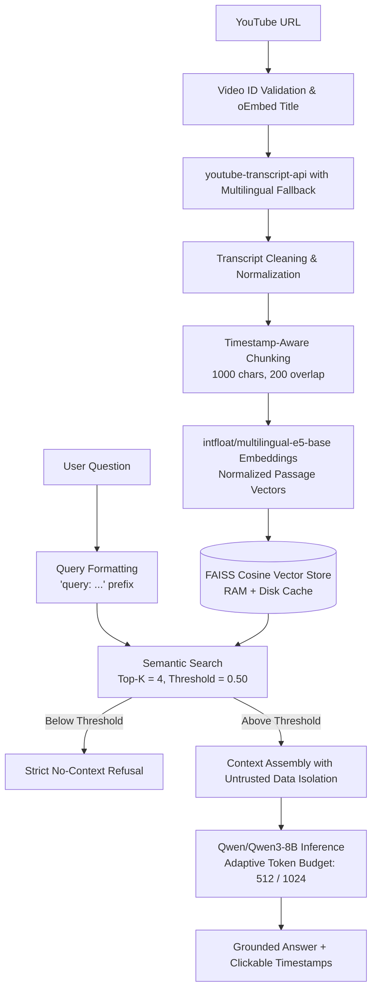

# AskTube — YouTube Video Q&A with Grounded RAG

Ask questions about any YouTube video and receive accurate, grounded answers backed by timestamped citations.

[](https://asktube.streamlit.app)
[](https://www.python.org/)
[](https://opensource.org/licenses/MIT)
[]()

---

## 🌐 Live Demo

* **Streamlit Web Application:** [AskTube on Streamlit Community Cloud](https://asktube.streamlit.app)
* *Note:* If running without preconfigured workspace secrets, you can provide any free read-only Hugging Face access token directly in the app sidebar.

---

## ✨ Features

* **Strict Transcript Grounding:** The LLM is constrained to synthesize answers strictly from retrieved video transcript chunks. If information is missing or unverified, it explicitly refuses rather than hallucinating.
* **Timestamp-Aware Citations:** Every retrieved chunk preserves original timestamp metadata, giving users exact `[MM:SS]` references that link directly into the YouTube video.
* **Multilingual Fallback:** Supports both manual subtitles and auto-generated transcripts across multiple languages with automatic fallback.
* **High-Accuracy Semantic Search:** Utilizes `intfloat/multilingual-e5-base` with asymmetric `passage:` and `query:` prefixes and normalized cosine similarity.
* **Zero Re-indexing Overhead:** FAISS vector stores are cached in session memory and ephemeral disk storage (`.rag_cache/`), avoiding redundant transcript downloads or re-embeddings.
* **Multi-Turn Session State:** Ask multiple questions and follow-ups in the same session without re-processing the video.
* **Absolute ₹0 / $0 Cost Design:** Deployed on Streamlit Community Cloud free tier, using CPU-based local embeddings, local FAISS vector store, and Hugging Face free-tier serverless inference.

---

## 🏗️ Architecture



---

## 🛠️ Tech Stack

* **Frontend & Deployment:** Streamlit (Community Cloud)
* **Orchestration & Chains:** LangChain (`langchain-core`, `langchain-community`, `langchain-huggingface`)
* **Vector Index:** FAISS (Local CPU Cosine Similarity)
* **Embeddings:** `intfloat/multilingual-e5-base` (Sentence-Transformers)
* **LLM:** `Qwen/Qwen3-8B` via Hugging Face Serverless Inference API
* **Transcript Extraction:** `youtube-transcript-api`
* **Optional API Backend:** FastAPI & Uvicorn (dual-entry architecture)

---

## ⚙️ How It Works

1. **Video Ingestion & Validation:** Validates YouTube URLs (standard, Shorts, embed, youtu.be) and retrieves video titles via YouTube oEmbed without requiring YouTube Data API keys.
2. **Transcript Extraction:** Fetches transcripts using `youtube-transcript-api` with language preference ranking and automatic fallback.
3. **Timestamp-Aware Chunking:** Groups transcript snippets into chunks of 1000 characters with 200 character overlap, preserving exact start and end seconds.
4. **Vector Indexing:** Generates 768-dimensional normalized embeddings with `multilingual-e5-base` using the `passage: ` prefix and indexes them in FAISS.
5. **Retrieval & Grounding:** Embeds the user query with `query: `, queries FAISS with a cosine similarity threshold of 0.50, and formats the top-4 chunks into a structured prompt that isolates transcript text as untrusted data.
6. **Adaptive Generation:** Routes normal queries with a 512 token budget and deep analytical queries with a 1024 token budget to prevent generation truncation.

---

## 🚀 Local Setup

### 1. Clone Repository
```bash
git clone https://github.com/hitesh-2005/AskTube.git
cd AskTube
```

### 2. Create Virtual Environment
```bash
# Windows
python -m venv .venv
.venv\Scripts\activate

# Linux / macOS
python3 -m venv .venv
source .venv/bin/activate
```

### 3. Install Dependencies
```bash
pip install -r requirements.txt
```

### 4. Configure Environment
Copy `.env.example` to `.env`:
```bash
cp .env.example .env
```
Edit `.env` and add your free Hugging Face User Access Token:
```env
HUGGINGFACEHUB_API_TOKEN=hf_your_free_token_here
```
*(Get a free token at [huggingface.co/settings/tokens](https://huggingface.co/settings/tokens))*.

### 5. Run the Application

#### Streamlit Web App (Recommended)
```bash
streamlit run streamlit_app.py
```

#### FastAPI Backend (Optional)
```bash
uvicorn backend.app:app --reload --port 8000
```

---

## 🧪 Verification & Tests

Run the complete offline test suite:
```bash
# Unit & core logic tests (64 tests)
python -m unittest test_main.py

# API contract & service tests (13 tests)
python -m unittest tests/test_api.py
```

---

## ☁️ Streamlit Community Cloud Deployment Guide

1. Fork or push this repository to GitHub: `https://github.com/hitesh-2005/AskTube`.
2. Go to [share.streamlit.io](https://share.streamlit.io) and log in with your GitHub account.
3. Click **New App** and configure:
   * **Repository:** `hitesh-2005/AskTube`
   * **Branch:** `main`
   * **Main file path:** `streamlit_app.py`
4. Expand **Advanced settings → Secrets** and add your Hugging Face token:
   ```toml
   HUGGINGFACEHUB_API_TOKEN = "hf_your_free_token_here"
   ```
5. Click **Deploy!**

---

## ⚖️ Free-Tier Limitations & Operational Realities

To maintain an absolute **₹0 / $0 cost**:
* **Hugging Face Serverless Inference:** Operates on the Hugging Face free tier. Requests may experience temporary queuing or cold starts if the model is waking up.
* **Ephemeral Storage:** The local FAISS cache is stored in the container's ephemeral disk. Vector indexes persist across questions during an active session, but rebuild on container restarts.
* **YouTube Transcript API:** Some videos may lack captions or have automated transcript fetching restricted by YouTube rate-limits on shared cloud IPs. In such cases, AskTube displays clear user-facing diagnostics.
* **Community Cloud Sleep:** Inactive Streamlit Community Cloud apps enter sleep mode and wake up automatically upon the next visit.
