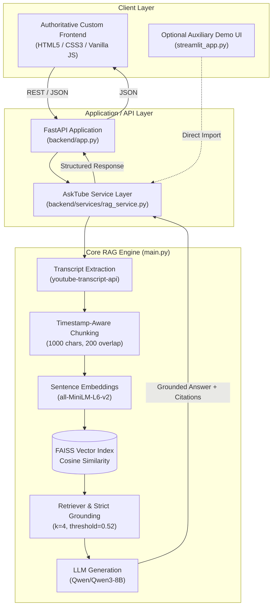

# AskTube — YouTube Video Q&A with Grounded RAG

Ask questions about any YouTube video and receive accurate, grounded answers backed by timestamped citations.

[](https://www.python.org/)
[](https://fastapi.tiangolo.com/)
[](https://www.langchain.com/)
[]()
[](https://opensource.org/licenses/MIT)

---

## 🏛️ Canonical Architecture

AskTube is built around a decoupled full-stack architecture with a custom frontend and a dedicated RAG service:


```mermaid
flowchart TD
    subgraph Client ["Client Layer"]
        A["Authoritative Custom Frontend<br/>(HTML5 / CSS3 / Vanilla JS)"]
        S["Optional Auxiliary Demo UI<br/>(streamlit_app.py)"]
    end

    subgraph API ["Application / API Layer"]
        B["FastAPI Application<br/>(backend/app.py)"]
        C["AskTube Service Layer<br/>(backend/services/rag_service.py)"]
    end

    subgraph Core ["Core RAG Engine (main.py)"]
        D["Transcript Extraction<br/>(youtube-transcript-api)"]
        E["Timestamp-Aware Chunking<br/>(1000 chars, 200 overlap)"]
        F["Sentence Embeddings<br/>(all-MiniLM-L6-v2)"]
        G[("FAISS Vector Index<br/>Cosine Similarity")]
        H["Retriever & Strict Grounding<br/>(k=4, threshold=0.52)"]
        I["LLM Generation<br/>(Qwen/Qwen3-8B)"]
    end

    A -->|REST / JSON| B
    B --> C
    S -.->|Direct Import| C
    C --> D --> E --> F --> G --> H --> I
    I -->|Grounded Answer + Citations| C
    C -->|Structured Response| B
    B -->|JSON| A
```

### Architectural Roles
1. **Primary & Authoritative Frontend (`frontend/`):** The canonical AskTube user interface. Implements a bespoke split-pane desktop layout (40/60 video/conversation balance), sticky 16:9 YouTube player, custom Mobbin/Intercom/Claude design tokens, and clickable timestamp references (`design.md`). Served directly by FastAPI at `/`.
2. **FastAPI Application Layer (`backend/app.py`):** The primary application backend. Exposes structured REST endpoints (`POST /api/videos/process`, `GET /api/videos/{video_id}`, `POST /api/videos/{video_id}/questions`, and `GET /api/health`).
3. **AskTube Service Layer (`backend/services/rag_service.py`):** Reusable business logic orchestrating session state, vector store persistence, and retrieval flows.
4. **Core RAG Engine (`main.py`):** The authoritative RAG implementation managing transcript acquisition, chunking, normalized MiniLM embeddings, cosine FAISS retrieval, untrusted transcript isolation, and grounded generation.
5. **Auxiliary Demo UI (`streamlit_app.py`):** An **optional**, additive presentation entry point developed for simple zero-cost cloud portfolio demonstrations. It delegates directly to `rag_service` and is **not** a replacement for the canonical custom frontend.

---

## 🌐 Optional Streamlit Demo

For cloud portfolio sharing where deploying full containerized web servers is not required, an optional Streamlit entry point is available:

* **Hosted Demo:** [AskTube on Streamlit Community Cloud](https://asktube-app.streamlit.app)
* *Note:* This is an auxiliary demo wrapper over the core RAG service; the primary application remains the custom frontend + FastAPI stack.

---

## ✨ Core Features

* **Strict Transcript Grounding:** The LLM is constrained to synthesize answers strictly from retrieved video transcript chunks. If information is missing or unverified, it explicitly refuses rather than hallucinating.
* **Timestamp-Aware Citations:** Every retrieved chunk preserves original timestamp metadata, giving users exact `[MM:SS]` references that link directly into the YouTube video.
* **Efficient Semantic Search:** Utilizes `sentence-transformers/all-MiniLM-L6-v2` with normalized cosine similarity, calibrated for low-memory container hosting.
* **Zero Re-indexing Overhead:** FAISS vector stores are cached in session memory (bounded LRU) and ephemeral disk storage (`.rag_cache/`), avoiding redundant transcript downloads or re-embeddings.
* **Multi-Turn Session State:** Ask multiple questions and follow-ups in the same session without re-processing the video.

---

## 🛠️ Tech Stack

* **Primary Frontend:** Custom HTML5, Vanilla CSS3 (custom design system), Vanilla JavaScript (`frontend/`)
* **Backend Application:** FastAPI, Uvicorn, Pydantic (`backend/`)
* **RAG Orchestration:** LangChain (`langchain-core`, `langchain-community`, `langchain-huggingface`)
* **Vector Index:** FAISS (`faiss-cpu`, cosine similarity)
* **Embeddings:** `sentence-transformers/all-MiniLM-L6-v2` (Sentence-Transformers)
* **LLM:** `Qwen/Qwen3-8B` via Hugging Face Serverless Inference API
* **Transcript Extraction:** `youtube-transcript-api`
* **Auxiliary Demo UI:** Streamlit (`streamlit_app.py`)

---

## ⚙️ How It Works

1. **Video Ingestion & Validation:** Validates YouTube URLs (standard, Shorts, embed, youtu.be) and retrieves video titles via YouTube oEmbed without requiring YouTube Data API keys.
2. **Transcript Extraction:** Fetches transcripts using `youtube-transcript-api` with language preference ranking and automatic fallback.
3. **Timestamp-Aware Chunking:** Groups transcript snippets into chunks of 1000 characters with 200 character overlap, preserving exact start and end seconds.
4. **Vector Indexing:** Generates 384-dimensional normalized embeddings with `all-MiniLM-L6-v2` and indexes them in FAISS.
5. **Retrieval & Grounding:** Embeds the user query, queries FAISS with a cosine similarity threshold of 0.52, and formats the top-4 chunks into a structured prompt that isolates transcript text as untrusted data.
6. **Adaptive Generation:** Routes normal queries with a 512 token budget and deep analytical queries with a 1024 token budget to prevent generation truncation.

---

## 🚀 Local Setup & Execution

### 1. Clone Repository
```bash
git clone https://github.com/hitesh-2005/AskTube.git
cd AskTube
```

### 2. Create Virtual Environment
```bash
# Windows
python -m venv .venv
.venv\Scripts\activate

# Linux / macOS
python3 -m venv .venv
source .venv/bin/activate
```

### 3. Install Dependencies
```bash
pip install -r requirements.txt
```

### 4. Configure Environment
Copy `.env.example` to `.env`:
```bash
cp .env.example .env
```
Edit `.env` and add your Hugging Face User Access Token:
```env
HUGGINGFACEHUB_API_TOKEN=hf_your_token_here
```

### 5. Run the Canonical Application (Recommended)

Start the FastAPI application which serves both the REST API and the authoritative custom frontend:
```bash
uvicorn backend.app:app --reload --port 8000
```
Open your browser at **`http://localhost:8000`** to access the custom AskTube web interface.

### 6. Run the Optional Streamlit Demo (Alternative)

If you wish to run the auxiliary Streamlit interface:
```bash
streamlit run streamlit_app.py
```

---

## 🧪 Verification & Tests

Run the complete offline test suite (84 tests):
```bash
# Unit & core logic tests (64 tests)
python -m unittest test_main.py

# API contract, bounded session, & service tests (20 tests)
python -m unittest tests/test_api.py

# Run all tests together
python -m unittest test_main.py tests/test_api.py
```

---

## 🚀 Production Deployment (Render Free)

AskTube is pre-configured for **$0 / ₹0 free cloud hosting** on **Render Free Web Services**:

* **Runtime:** Python 3.10 native environment
* **Service Architecture:** FastAPI app serving both the REST API and the authoritative custom frontend
* **Execution:** Single Uvicorn worker (`--workers 1`) to fit within the 512 MB memory constraint
* **Embedding Engine:** `sentence-transformers/all-MiniLM-L6-v2` (384 dimensions, cosine threshold 0.52)
* **LLM Engine:** Serverless `Qwen/Qwen3-8B` via Hugging Face Inference API
* **Storage:** Ephemeral disk (`.rag_cache/` automatically created; no persistent disk or database needed)

### Deployment Steps (Render Blueprint / Manual)

1. **Push your repository** to GitHub: `https://github.com/hitesh-2005/AskTube`.
2. **Log into [Render](https://render.com/)** and click **New +** → **Blueprint** (or **Web Service**).
3. Connect your `AskTube` repository.
4. If deploying via **Blueprint**, Render automatically reads [`render.yaml`](render.yaml).
5. If creating a **Web Service** manually, set:
   * **Name:** `asktube`
   * **Environment:** `Python`
   * **Plan:** `Free`
   * **Build Command:** `pip install --no-cache-dir torch --index-url https://download.pytorch.org/whl/cpu --extra-index-url https://pypi.org/simple && pip install -r requirements.txt`
   * **Start Command:** `uvicorn backend.app:app --host 0.0.0.0 --port $PORT --workers 1`
6. Add the following **Environment Variables**:
   * `HUGGINGFACEHUB_API_TOKEN`: Your Hugging Face User Access Token (Marked secret)
   * `PYTHON_VERSION`: `3.10.11`
   * `EMBEDDING_MODEL`: `sentence-transformers/all-MiniLM-L6-v2`
   * `RELEVANCE_SCORE_THRESHOLD`: `0.52`
   * `MAX_ACTIVE_SESSIONS`: `2`
7. Click **Deploy Web Service**.

> [!NOTE]
> **Free Tier Characteristics:** Render Free services sleep after 15 minutes of inactivity. When a new user accesses the live URL, the instance wakes up (initial cold-start latency is typically 30–50 seconds). The custom frontend includes non-blocking visual spinners and connection retry mechanisms.

---

## ☁️ Optional Streamlit Cloud Deployment Guide

If deploying the auxiliary Streamlit demo to Streamlit Community Cloud:

1. Push this repository to GitHub: `https://github.com/hitesh-2005/AskTube`.
2. Go to [share.streamlit.io](https://share.streamlit.io) and log in with GitHub.
3. Click **New App** and select:
   * **Repository:** `hitesh-2005/AskTube`
   * **Branch:** `main`
   * **Main file path:** `streamlit_app.py`
4. In **Advanced settings → Secrets**, provide your Hugging Face token:
   ```toml
   HUGGINGFACEHUB_API_TOKEN = "hf_your_token_here"
   ```
5. Click **Deploy!**

